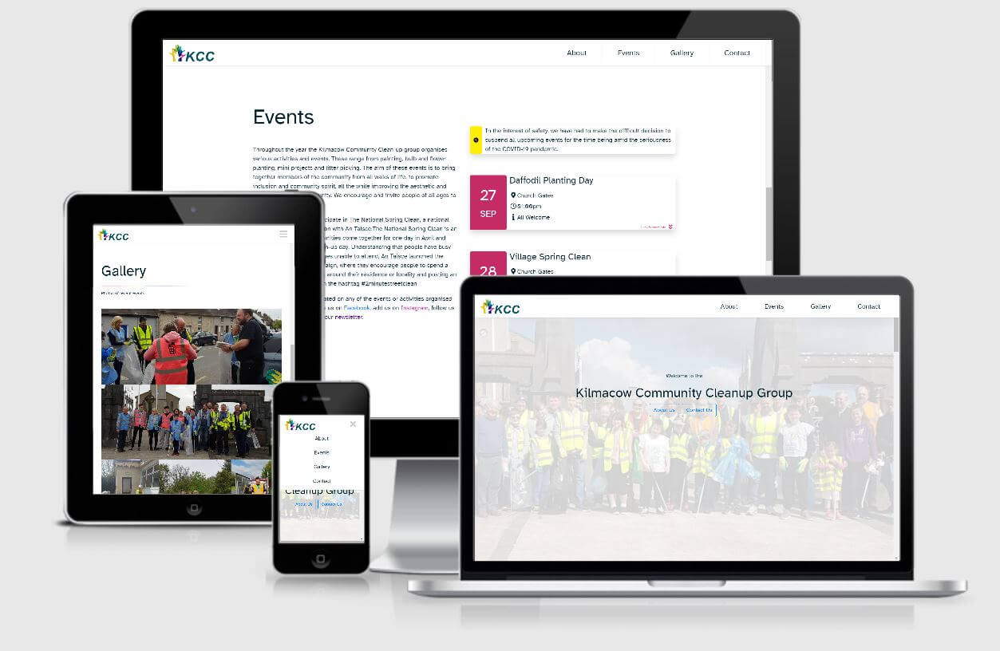
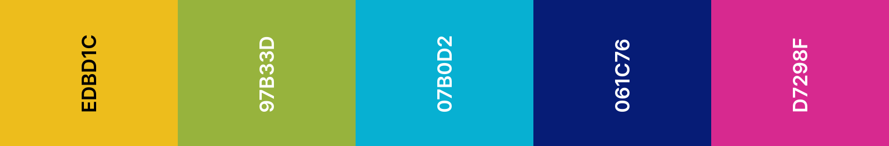

#  Kilmacow Community Clean-up

[View the live project here.](https://edwarddoyle.github.io/CI-MS1-KCC/)

To open links in a new tab:

MAC : &nbsp;  &nbsp; + &nbsp; 'click' 

Windows / Linux : &nbsp;   &nbsp; + &nbsp; 'click'

>This website was undertaken as my submission for the User Centric Frontend Development Milestone Project (MS1).

## Table of Contents

* [Overview](<#overview>)
* [UX](<#ux>)
  * [User Stories](<#user-stories>)
  * [Strategy](<#strategy>)
    * [Project Goals](<#project-goals>)
    * [Customer Goals](<#customer-goals>)
  * [Scope](<#scope>)
  * [Structure](<#structure>)
  * [Skeleton](<#skeleton>)
    * [Wireframes](<#wireframes>)
  * [Surface](<#surface>)
    * [Colours](<#colours>)
    * [Typography](<#typography>)
    * [Images](<#images>)
* [Features](<#features>)
* [Technologies Used](<#technologies>)
* [Deployment](<#deployment>)
  * [Creation](<#creation>)
  * [Hosting](<#hosting>)
  * [Local](<#local>)
* [Credits](<#credits>)

## Overview

>The Kilmacow Community Clean-up (KCC) page was developed to provide visitors with an overview of the events and activities carried out by the KCC. The KCC group currently advertises their events and activities in a local newsletter (digital and print) and through their social media channels. Recently KCC members have raised concerns over attendance figures at their events. It was identified that the decrease was due to previous attendees not having access to information about dates and times of events, as many of them were not on social media. A website was proposed to solve this issue. The KCC outlined simplicity and accessibility to be the core features of the website. The website would need to work on both mobile and desktop as the age of members ranged from 5 years old to 80 years old.

[Back to Top](<#table-of-contents>)

## UX

### User Stories

>#### First Time Vistiors

* "I would like to view information about the KCC and possibly follow the group on a social media platform"

* "I would like to see photos of previous events / activities"

* "I would like to subscribe to a newsletter or mailing list that could inform me of upcoming events / activities"

>#### Returning Visitors

* "I would like to see if any events have been added / updated since my last visit"

* "I would like to contact the KCC group about getting involved"

>#### Frequent Visitors

* "I want to contact the KCC to suggest local areas that require attention and to suggest future activities"

[Back to Top](<#table-of-contents>)

### Strategy

>#### Project goals

* Encourage more community members to events and activities by providing visitors with information about upcoming events and activities.

* Clean UI / UX for simple navigation. Visitors are from a traditionally non-web-savvy demographic.

* Communicate effectivley the importance of 'Pride of Place' and the goals of the KCC

>#### Customer goals

* Enable visitors to find information on upcoming community events

* Allow visitors to easily contact group admin about possible future events and report areas that need attention (cleaning, planting, painting)

* Easy to navigate website

* Increase newsletter subscribers and social media followers

[Back to Top](<#table-of-contents>)

### Scope
* The client has requested a 'basic' brochure style static website with a clean unclutered layout. 
* The client has requested I take full ownership of the development and maintenance of the site. 
* As my coding skills develop the future features will be added to the site.

[Back to Top](<#table-of-contents>)

### Structure

The website is a single page website. Upon navigating to the site, the visitor will be greeted with a landing page style section, followed by four content sections. These content sections include: About section, Events Section, Gallery section and Contact section, with a footer placed at the bottom of the website.
#### Home: 
>The homepage section of the site contains a full width hero image, with welcome text and quick navigation buttons in the foreground, one that leads directly to the About section and one that leads directly to the Contact section. This will allow returning and frequent visitors to navigate quickly to the contact section if they wish to contact the group without navigating through content they have seen previously. During discussions with the client, they identified websites that they found aesthetically pleasing, mentioning specifically the use of a hero image to grab visitor’s attention immediately, especially first-time visitors.
#### About: 
>The about section contains a block of text describing the Kilmacow Community Clean-up Group. The client hopes this text will encourage new users to sign up for the newsletter or follow the group on one of it’s social media channels. The Kilmacow Community Clean-up Group also hopes the message this text conveys reinforces the importance of community inclusion and ‘Pride of Place’. This section will also include a large image, with the intention of ‘breaking’ up the section of text and providing a splash of colour to the section.
#### Events:
>The Events section will contain a block of text similar to the About section, but this text will outline the events and activities that are organised by the KCC. It is hoped that the message conveyed in this section will encourage new and returning visitors to attend one of the events or activities organised by the KCC. The events section will also contain cards, initially outlining overview information about upcoming events, such as meeting location, time and invitees. The overview cards can be expanded to display more in-depth information.
#### Gallery:
>The Gallery section will contain a Bootstrap carousel that is visible on desktop & large tablet screens. The carousel will auto rotate displaying photos provided by the KCC. On smaller mobile screens the carousel will be hidden and a static image gallery will be in it's place.
#### Contact: 
>The Contact section contains a dual-purpose form, it can be used as a method of contacting the KCC, but also it includes a tick box for new and returning visitors to sign up for the KCC newsletter. The form will allow visitors include their name and email address, a text area will provide a method for visitors to include a personalised message. The contact section also includes the contact details for the KCC, such as email address, postal address and contact number. The website footer sits below the contact section, this includes a copyright message and the year.

[Back to Top](<#table-of-contents>)

### Skeleton

#### Wireframes
[Balsamiq Wireframes](https://balsamiq.com/wireframes/) was used to wireframe the website.

>* [Home Section](assets/docs/home.pdf)
>* [About Section](assets/docs/about.pdf)
>* [Events Section](assets/docs/events.pdf)
>* [Gallery Section](assets/docs/gallery.pdf)
>* [Contact Section](assets/docs/contact.pdf)

[Back to Top](<#table-of-contents>)

### Surface

#### Colours

> #00202a is the main font colour. The client requested the text colour in the logo be used, however, the logo font colour did not provide enough contrast against the white background. #00202a is half way between black and the logo font colour.

>The client requested a clean colour scheme on the website. White was chosen as the predominant colour with highlights provided by shadows and hints of colours taken from the client's logo. The main colours of the logo are:

#### Typography

>The font used throughout the website is Atkinson Hyperlegible, with Sans-Serif used as a fallback. The font weight and font size css attributes are used with the font for emphasis and hierarchy. Atkinson Hyperlegible was chosen, as it focuses on letterform distinction to increase character recognition, ultimately improving readability. You can find out more [here](<https://www.brailleinstitute.net/freefont>)

#### Images

>All images for the website were provided by The Kilmacow Community Clean-up Group. A new logo was created for the website as the existing logo did not work for web or print. I gave the KCC group access to my [Adobe Stock](https://stock.adobe.com/) account, so they could select some stock photos if required. The group found a logo they liked and I modified it to suit their requirements. The licence for the logo is available 
[here](assets/docs/logolicence.pdf).

[Back to Top](<#table-of-contents>)

## Features

### Overview:
* Responsive Single Page Website built with HTML, CSS and Bootstrap
* Fixed navigation bar for easy navigation as per client’s request
* Call to action button on homepage for quick navigation to about and contact sections
* Social media links present throughout, without being too obtrusive
* Expandable and collapsible event cards
* Responsive image gallery 
* Contact form with HTML validation, radio button is also present for subscribe to newsletter function

#### Navbar
>* The navbar should be easily accessible and fixed to the top of the browser across all webpage sections
>* Navbar should display KCC logo on the left and links to page sections (menu items) on the right 
>* The logo should appear clear across all browser sizes
>* The menu items should change size and colour when hovered over on devices with a mouse
>* The menu items should collapse into a dropdown menu, accessible through a hamburger icon on mobile devices
>* The menu links should direct the user to the relevant page section
#### Home Section
>* The home section should have a hero image spanning the width of the viewport
>* The hero image should be responsive across all browsers
>* The home text should be legible across all browser sizes
>* Two call to action buttons should sit on top of the hero image, one that navigates to the about section when clicked and one that navigates to the contact section when clicked

#### About Section	
>* The About section is accessed by clicking the cta button on the home section, by clicking the relevant link on the navbar or by scrolling directly to it
>* The navbar should appear fixed to the top of this section
>* Text containing information about the KCC should sit on the left of the page with a large image to right to add colour and break up the text. The image should wrap below the text on mobile devices.

#### Events Section
>* The Events section is accessed by clicking the relevant link on the navbar or by scrolling directly to it
>* The navbar should appear fixed to the top of this section
>* Text containing information about the KCC events should sit on the left of the page with event cards on the right. The event cards should wrap below the text on mobile devices.
>* The text should contain inline links to external websites and social media, opening these links in new browser tabs.
>* The event cards should expand and collapse when the ‘click for more info’ text or icons are clicked

#### Gallery Section
>* The Gallery section is accessed by clicking the relevant link on the navbar or by scrolling directly to it
>* The navbar should appear fixed to the top of this section
>* On mobile devices the gallery will appear as a static collection of images
>* On larger tablets and on desktops the gallery images will be contained in carousel. The carousel can be scrolled by clicking the navigation arrows either side of the displayed images. Upon initial navigation to the gallery the carousel will begin auto scrolling through the images. The carousel indicators should highlight which image in the collection is currently visible

#### Contact Section
>* The Contact section is accessed by clicking the cta button on the home section, by clicking the relevant link on the navbar or by scrolling directly to it
>* The navbar should appear fixed to the top of this section
>* The Contact sections has two subsections.
>* The first section displays contact information for the KCC including postal address, email address, phone number and social media links. These links should open in new browser tabs.
>* The second section should contain a contact form where visitors can contact the KCC and also use the form to subscribe to the newsletter.
>* The form contains name and email inputs that are required, a textarea for general comments or messages and a radio button to subscribe to the newsletter.
>* The submit button will not be functional until the backend code for the form is implemented, it is outside the scope of this project

#### Footer
>* The footer should sit below the contact section
>* It should contain a basic copyright notification

Features to implement:
* Add to calendar button on events cards
* Contact form backend
* Cookie notification pop up and privacy policy 

[Back to Top](<#table-of-contents>)

## Testing

[Back to Top](<#table-of-contents>)

## Technologies
### Languages & Frameworks
* HTML5 
* CSS3
* [Bootstrap](https://getbootstrap.com/) - linked via CDN

### Fonts & Icons 
* [Atkinson Hyperlegible](<https://www.brailleinstitute.net/freefont>) - self hosted as no CDN avaialble at time of publishing
* [Font Awesome](<https://fontawesome.com/>) - linked via CDN

### Development, Version Control, Storage, Debbugging
* [Gitpod IDE](https://www.gitpod.io) - IDE 
* [Git](https://git-scm.com/) - version control system
* [Github](https://github.com/) - repository storage
* [Chrome DevTools](https://developers.google.com/web/tools/chrome-devtools) - used for debugging code

### Software & Applications
* [Adobe Photoshop](https://www.adobe.com/ie/products/photoshop.html) - image resizing & editing
* [Adobe Illustrator](https://www.adobe.com/ie/products/illustrator.html) - used for logo editing
* [Balsamiq Wireframes](https://balsamiq.com/wireframes/) - used for wireframing website
* [Typora](https://typora.io/) - help with markdown writing & editing 
* [Microsoft Word](https://www.microsoft.com/en-ie/microsoft-365/word) - content wrtiting

### Resources
* [Tiny PNG / JPG](https://tinyjpg.com/) - compressing images
* [Am I Responsive](http://ami.responsivedesign.is/#) - viewport image for README
* [CSS Matic](https://www.cssmatic.com/box-shadow) - css box shadow generator
* [Coolors](https://coolors.co/) - colour pallette genrator, used in README surface section

### Testing 
* [Validator](https://validator.w3.org/) - HTML code validator
* [Jigsaw](https://jigsaw.w3.org/css-validator/) - CSS code validator
* [GTmetrix](https://gtmetrix.com/) - Site performance testing
* [WAVE](https://wave.webaim.org/) - Site accessibility testing
* [Online Spell Check](https://www.online-spellcheck.com/) - README spell checker
* [LambdaTest](https://www.lambdatest.com/) - cross browser testing

[Back to Top](<#table-of-contents>)

## Deployment
### Creation
The project was created using the Code Institute workspace template, available [here](https://github.com/Code-Institute-Org/gitpod-full-template).
To use this template:
1.	Click use this template
2.	Name the new repository and select ‘Create repository from template’
3.	Navigate to the newly created repository and select Gitpod*
4.	The template workspace should now open in Gitpod 
>*The Gitpod browser extension must be installed for this option to become visible. Gitpod provide a browser extension for Chrome [here](https://chrome.google.com/webstore/detail/gitpod-dev-environments-i/dodmmooeoklaejobgleioelladacbeki) and for Firefox [here](https://addons.mozilla.org/en-US/firefox/addon/gitpod/)
### Hosting
This website is hosted on [Github Pages](https://pages.github.com/). To deploy the live site, I followed these steps:
1.	Navigate to the Github repository
2.	Click the ‘Settings’ tab
3.	In the Github pages section, select Master Branch as the source and click save.
4.	The site URL is now displayed*
>*The site can take a period of time to go live
### Local
To run this project locally there are two options through Github (clone or download). To clone or download, navigate to the repository, click the Code button and select Clone or Download:
1.	Clone: This option provides you with a URL that can be used in your local IDE. Use the 'git clone' command followed by the provided URL to create a clone of the project locally.
2.	Download: This option provides a .zip file that can be downloaded, extracted and deployed to a local webserver or edited in your IDE.

[Back to Top](<#table-of-contents>)

## Credits
### Content
All text content was written by myself with approval from The Kilmacow Community Clean-up Group.

### Images
>All images for the website were provided by The Kilmacow Community Clean-up Group. A new logo was created for the website as the existing logo did not work for web or print. I gave the KCC group access to my [Adobe Stock](https://stock.adobe.com/) account, so they could select some stock photos if required. The group found a logo they liked and I modified it to suit their requirements. The licence for the logo is available 
[here](assets/docs/logolicence.pdf).

### Code Snippets
* [Orel Eliyahu 04/04/2016 stackoverflow](https://stackoverflow.com/questions/36405991/bootstrap-toggle-menu-on-one-page-site-does-not-uncollapse-when-clicked) - close dropdown menu when link is clicked.
* [mouse0270 bootsnip](https://bootsnipp.com/snippets/kMRrW) - The layout of the 'event cards' was inspired by mouse0270, however the code was not responsive so I replicated similar cards using bootstrap and custom code
* [boostrap documentation](https://getbootstrap.com/docs/4.0/components/carousel/#with-indicators) - gallery carousel layout
* [Jim Morel CI-MS1-Explore-Ireland](https://github.com/JimLynx/CI-MS1-Explore-Ireland) - inspiration for gallery section
* [Unison Tek 12/06/18 stackoverflow](https://stackoverflow.com/questions/46249541/change-arrow-colors-in-bootstraps-carousel) - change default carousel indicators to use fontawesome icons
* [Theodore K. 09/08/2016 stackoverflow](https://stackoverflow.com/questions/38850419/how-to-create-multi-color-border-with-css) - multi-colour border
* [John D. Jameson 26/07/2018 css-tricks](https://css-tricks.com/styling-underlines-web) - styling links on the web

### Acknowledgements
> I would like to thank my mentors Seun Owonikoko & Rohit Sharma for their advice and guidance
> I would also like to give a special mention to past pupils / current tutors for their invaluable knowledge and willingness to share it on slack and on the video conferences they hosted - [Jim Morel](https://github.com/JimLynx), [Anna Greaves](https://github.com/AJGreaves)

[Back to Top](<#table-of-contents>)