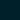

#  Kilmacow Community Clean-up

[View the live project here.](https://www.google.ie){target="_blank"}

This website was undertaken as my submission for the User Centric Frontend Development Milestone Project (MS1).

## Table of Contents

* [Overview](<#Overview>)
* [UX](<#UX>)
  * [User Stories](<#User Stories>)
  * [Strategy](#Strategy)
  * [Scope](#Scope)
  * [Structure](#Structure)
    * [Project Goals](<#Project Goals>)
    * [Customer Goals](<#Customer Goals>)
  * [Skeleton](#Skeleton)
    * [Wireframes](<#Wireframes>)
  * [Surface](#Surface)
    * [Colours](<#Colours>)
    * [Typography](<#Typography>)
    * [Images](<#Images>)
* [Features](#Features)
* [Technologies Used](#Technologies)

## Overview

>The Kilmacow Community Clean-up (KCC) page was developed to provide visitors with an overview of the events and activities carried out by the KCC. The KCC group currently advertises their events and activities in a local newsletter (digital and print) and through their social media channels. Recently KCC members have raised concerns over attendance figures at their events. It was identified that the decrease was due to previous attendees not having access to information about dates and times of events, as many of them were not on social media. A website was proposed to solve this issue. The KCC outlined simplicity and accessibility to be the core features of the website. The website would need to work on both mobile and desktop as the age of members ranged from 5 years old to 80 years old.

[Back to Top](<#Table of Contents>)

## UX

### User Stories

>#### First Time Vistiors

* "I would like to view information about the KCC and possibly follow the group on a social media platform"

* "I would like to see photos of previous events / activities"

* "I would like to subscribe to a newsletter or mailing list that could inform me of upcoming events / activities"

>#### Returning Visitors

* "I would like to see if any events have been added / updated since my last visit"

* "I would like to contact the KCC group about getting involved"

>#### Frequent Visitors

* "I want to contact the KCC to suggest local areas that require attention and to suggest future activities"

[Back to Top](<#Table of Contents>)

### Strategy

>#### Project goals

* Encourage more community members to events and activities by providing visitors with information about upcoming events and activities.

* Clean UI / UX for simple navigation. Visitors are from a traditionally non-web-savvy demographic.

* Communicate effectivley the importance of 'Pride of Place' and the goals of the KCC

>#### Customer goals

* Enable visitors to find information on upcoming community events

* Allow visitors to easily contact group admin about possible future events and report areas that need attention (cleaning, planting, painting)

* Easy to navigate website

* Increase newsletter subscribers and social media followers

[Back to Top](<#Table of Contents>)

### Scope

[Back to Top](#Table of Contents)

### Structure

[Back to Top](<#Table of Contents>)

### Skeleton

#### Wireframes (pdf format)

To open links in a new tab:
 + click on  
 + click on  or 

[Balsamiq Wireframes](https://balsamiq.com/wireframes/) was used to wireframe the website.

>* [Home Section](assets/docs/home.pdf)
>* [About Section](assets/docs/about.pdf)
>* [Events Section](assets/docs/events.pdf)
>* [Gallery Section](assets/docs/gallery.pdf)
>* [Contact Section](assets/docs/contact.pdf)

[Back to Top](<#Table of Contents>)

### Surface

#### Colours

> #00202a is the main font colour. The client requested the text colour in the logo be used, however, the logo font colour did not provide enough contrast against the white background. #00202a is half way between black and the logo font colour.

>The client requested a clean colour scheme on the website. White was chosen as the predominant colour with highlights provided by shadows and hints of colours taken from the client's logo. The main colours of the logo are:

#### Typography

>The font used throughout the website is Atkinson Hyperlegible, with Sans-Serif used as a fallback. The font weight and font size css attributes are used with the font for emphasis and hierarchy. Atkinson Hyperlegible was chosen, as it focuses on letterform distinction to increase character recognition, ultimately improving readability. You can find out more [here](<https://www.brailleinstitute.net/freefont>){target="_blank"}

#### Images

[Back to Top](<#Table of Contents>)

## Features

[Back to Top](<#Table of Contents>)

## Technologies 🔧